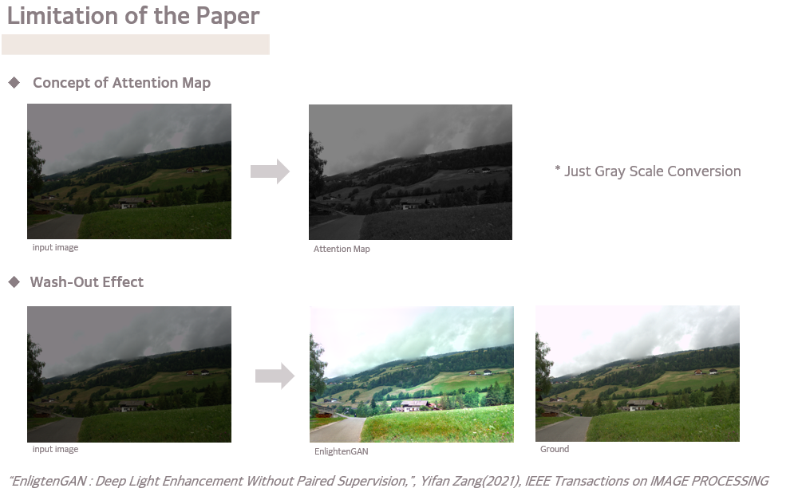
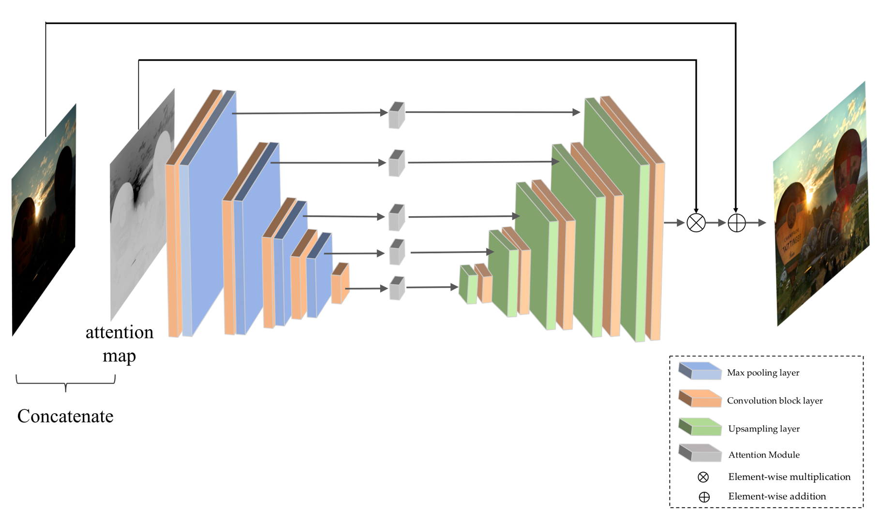
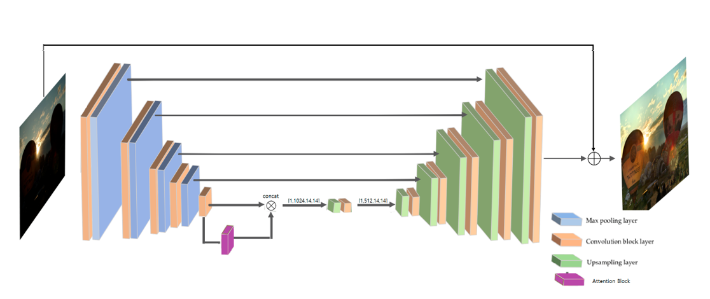
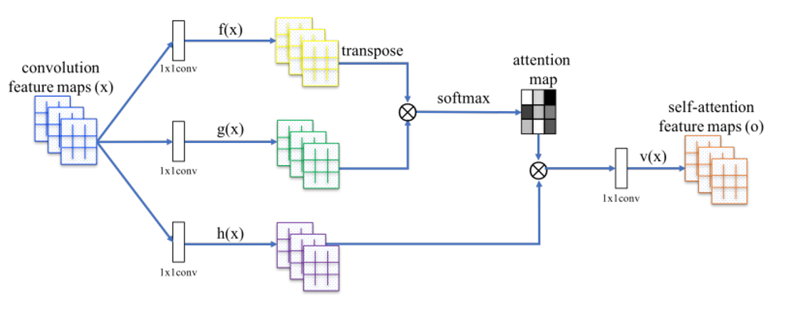
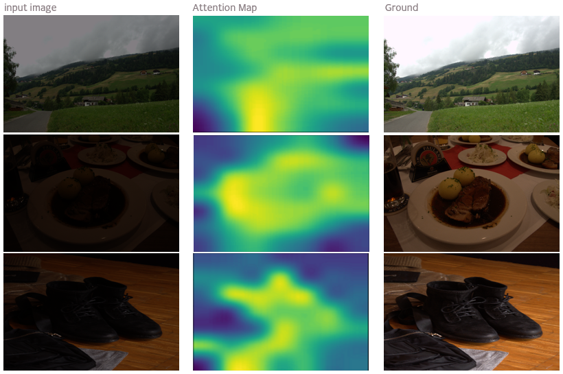
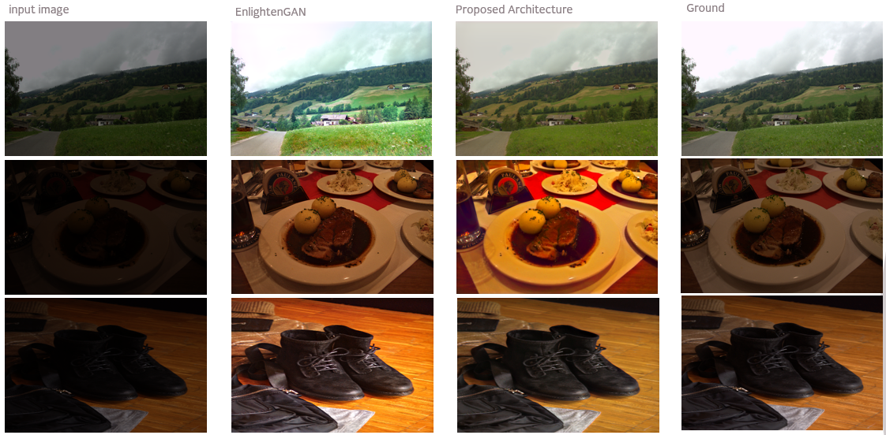
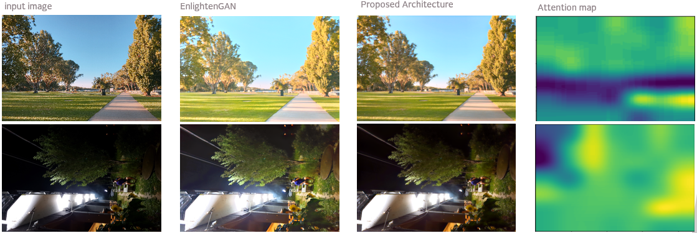
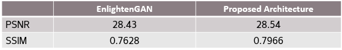

# GraduatePrj
## 2023 Graduate Project, Using EnlightenGAN, Integrating Self-Attention from SAGAN into EnlightenGAN

### Notion Link
[[Development Note during Prjoect]](https://www.notion.so/Development-note-fa16d62bc29443dabff7f0895537c4e8?pvs=4)  

[[Overview of GraduatePrj]](https://www.notion.so/0e6cedfdda5d4215a2cc6bbe0b77b469?pvs=4)

=======
## Base Paper
### EnlightenGAN: Deep Light Enhancement without Paired Supervision
[Yifan Jiang](https://yifanjiang19.github.io/), Xinyu Gong, Ding Liu, Yu Cheng, Chen Fang, Xiaohui Shen, Jianchao Yang, Pan Zhou, Zhangyang Wang

[[Paper]](https://arxiv.org/abs/1906.06972) [[Supplementary Materials]](https://yifanjiang.net/files/EnlightenGAN_Supplementary.pdf)

=======
## Limits of the Paper

## EnlightenGAN's Generator Architecture
  

## Modified Generator Architecture
  
Add Self-Attention Block
form Self-Attention Generative Adversarial Network, Han Zhang, Ian Goodfellow, Dimitris Metaxas, Augustus Odena

## Used Self-Attention Block Architecture

## Modified model result

## Improvement
